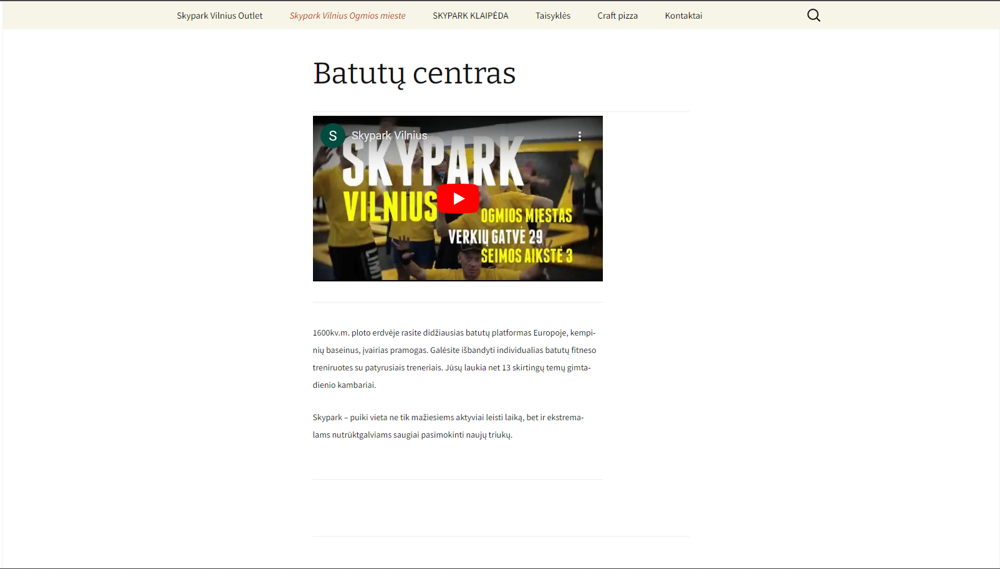
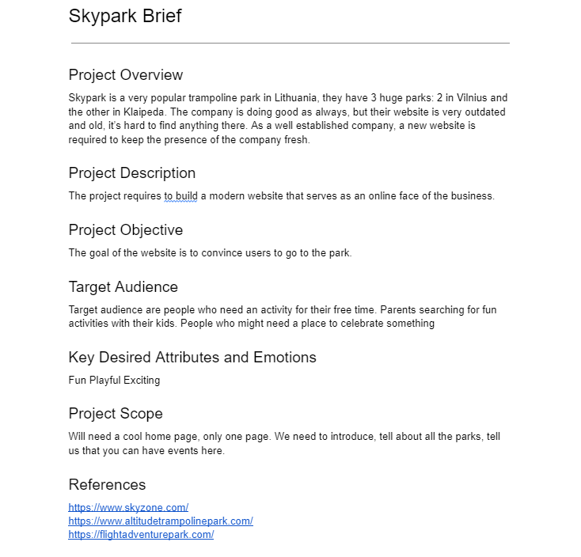
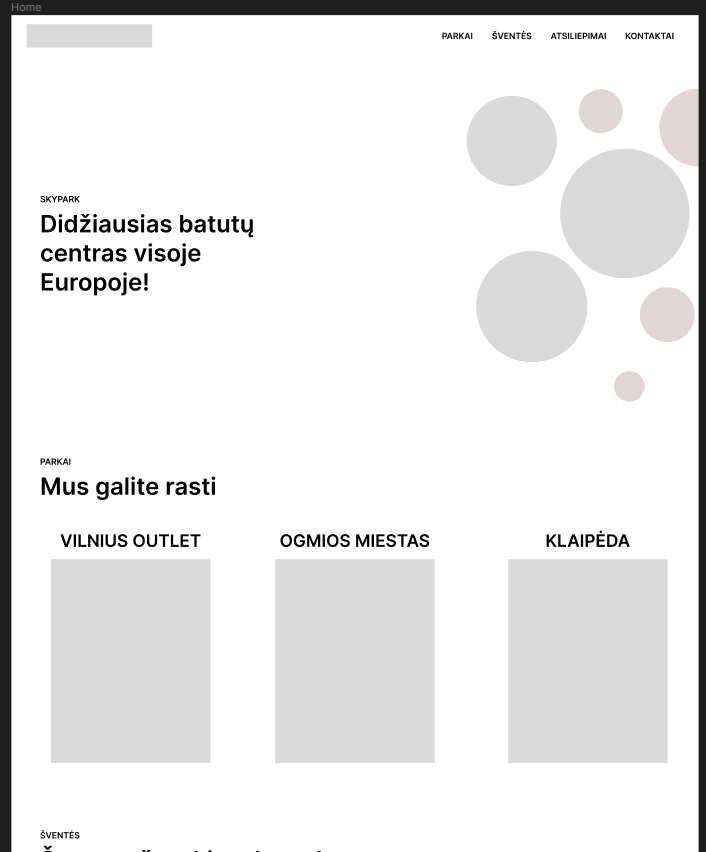
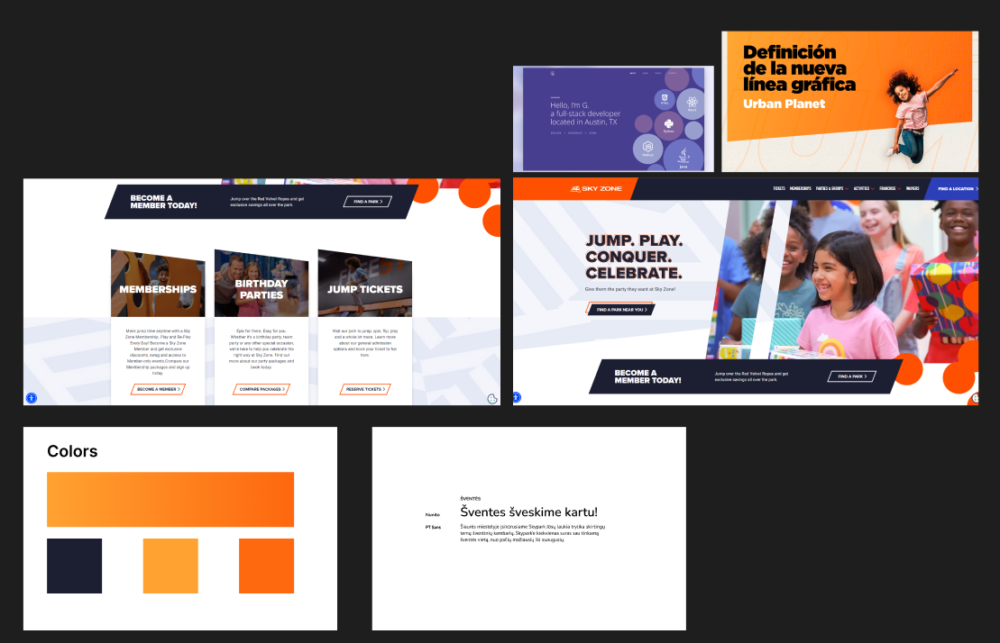
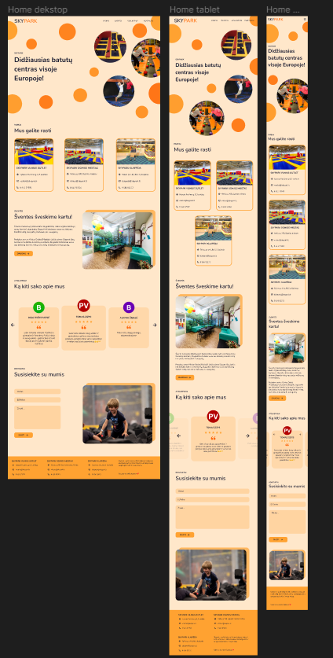
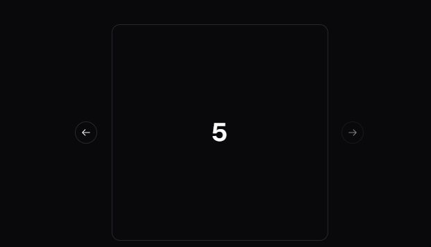

Hello anyone reading, this is my first blog post. Today we are gonna talk about how I made a website redesign after watching a short course. The target for this was "Skypark", it is an awesome and really popular trampoline park in Lithuania. Being so good and popular, they have a simple wordpress website, with almost no design whatsoever, so I thought why not give it a shot to make it better. By the way the course I watched is from "Flux Academy" on youtube [here](https://www.youtube.com/watch?v=j6Ule7GXaRs).

Here's a picture of how the original website looks, you can go check it yourself [here](https://www.skypark.lt/).

## Planning phase

So first of all we need to figure out what I want to make, what are my goals and so on. For this the course gave me a brief template to fill out with some information. To be honest I didn't really find it useful, but maybe that's just because it was a single page and I'm the one to make the choices. I think it would be a great way to start, if you are working with another company and you need to get a understanding for their goals.

The next step of planning is figuring out how many pages and what sections we need. This is called a **sitemap**. I wanted to keep this project short so I kept it to a single page. For the sections I chose these:

- Navigation bar
- Hero
- Park locations
- Events (a bit of information when you want to book a birthday room or something like that)
- Testimonials
- Contact us
- Footer

And lastly we need to think about the structure for this website and it was time to make a wireframe. For this I used Figma, I haven't really used it much, but it wasn't very hard to do stuff there. You can find the whole design file [here](https://www.figma.com/file/mCW05NvUvonb4jr6hlcCS7/Skypark?type=design&mode=design&t=6hGofRCTtjZvAspw-1).

So with some thinking I came up with the wireframe. For some reason I thought those bubbles would be nice, which was a pain to implement later :).

## Design phase

Finally reached the design part, in the course they told me to make a mood board for this project, also choose the font and colors beforehand. Also you should figure out the imagery during this, but Skypark didn't have any images whatsoever, so I found some on the internet and saved it to a folder on my machine. I made a page for this in figma.

And finally the real design. I copied over the wireframe then started changing the fonts for the one I chose. Added colors, imagery and details. After making the page for desktop users, I went ahead and did the same for tablets and phones.

It's not very innovative, but as I'm not really creative and just starting out with design I think it looks okay. Again, you can look at the whole design in figma [here](https://www.figma.com/file/mCW05NvUvonb4jr6hlcCS7/Skypark?type=design&mode=design&t=6hGofRCTtjZvAspw-1).

## Development phase

Yay, familiar part finally. For this simple website I used next.js with react and tailwindcss. I know that there was no reason to use next.js, but I like that they can optimize fonts and images for me. Also I'm still learning it so why not. I started with mobile design first, because tailwind is mobile first.

At first for the bubble hero section, I thought of just making and image, but then I settled with individual divs and absolute positioning which was a pain a little.

Next I went for the navigation, it's quite simple just a button and when you press it the scrolling is locked and a the navigation slides out.

For parks section, it was also straightforward just some divs and a grid to make them nice.

Events section was even easier just some text and a Image. If you're wondering how I added that backdrop to it, I just translate and scale the image a bit and add a div with color background.

### Pain with the testimonial carrousel

Now the hardest part was surprisingly the testimonial section. I wanted to add swiping and also the buttons to change between testimonials. I also wanted it to overflow the screen and the active testimonial to be centered. Couldn't find any tutorial for this, but somehow I made it work.

The solution was to have a flex container that centers another flex container with the width we want testimonial to be, then add all of testimonials into that container. Note that we can't use gap property here, because then we have problems centering the active one. And to move to another testimonial we just change the translate property.

That was the easy part, now how do we implement infinite repeating scrolling. For that we need to add extra clones of testimonials to each side of the carrousel, then when we reach the end and on the next one we would need to start all over again, we let it slide to the clone, then on transitionend, we remove transition, then move from the clone to the real one. For the user this appears infinite and they don't see that sliding back animation when we reach the end, like most other carrousels have.

This is what I mean by sliding back animation:

## Contact us form

For this I just found a really easy to use form service provider formspree. They can handle the form submission for you, errors and other stuff. Also you will get an email when someone submits the form, so you can respond to them quickly.

After that it was making a simple footer and making the design responsive.

## The end

Thank you for reading this and you can check out the github [repo](https://github.com/AuJezus/skypark-redesign) here. And the live website hosted on vercel [here](https://skypark-redesign.vercel.app/).
