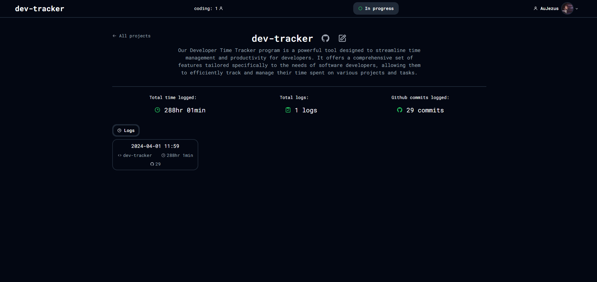

This project stemmed from a personal need to better manage my time and track my development activities. With the Developer Time Tracker, I aimed to create a simple yet effective tool that allows developers to monitor their time.

While developing this tool I found out about wakatime and all my plans of building a website for my own need fell apart, because wakatime integrates directly into the IDE. But nevertheless I continued on finishing this project.

## Features

- **Time Tracking and Commit Logging:** Keep a record of the time you spend on each project along with the commits you've made.
- **Project-based Time Monitoring:** Easily monitor and analyze how much time you've allocated to different projects.
- **Profile Sharing:** Make your profile public to share your development statistics with others.
- **Project and Log Separation:** Organize your tracking efforts by separating them into distinct projects and logs.
- **Random qoutes** on the work page.

## Development Journey

Building this tool was an exciting journey filled with learning and challenges. I started by outlining the core functionalities I needed, focusing on simplicity and ease of use.

As always while doing this I was learning new tools, like supabase and couple of other handy libraries.

One hard part was to get the commits working, I ran into a problem with supabase's way of managing github accounts. Supabase doesn't manage session keys for you and you need to handle them yourself. It took me a long time to understand that and also implement my own solution. But I did it.

## Conclusion

While this might not be a very feature-full and buggy time tracker, it was a fun journey to build. I learned a lot and got better. If you want you can contribute to the code base or write an issue about a bug you found. Github repo [here](https://github.com/AuJezus/developer-time-tracker).

Here's some pages to look at:

Work page:

Project page:

Profile page:

Profile settings page:

Thank you for joining me on this journey!
