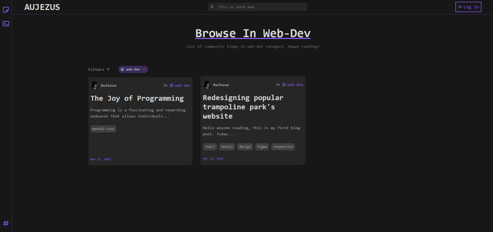
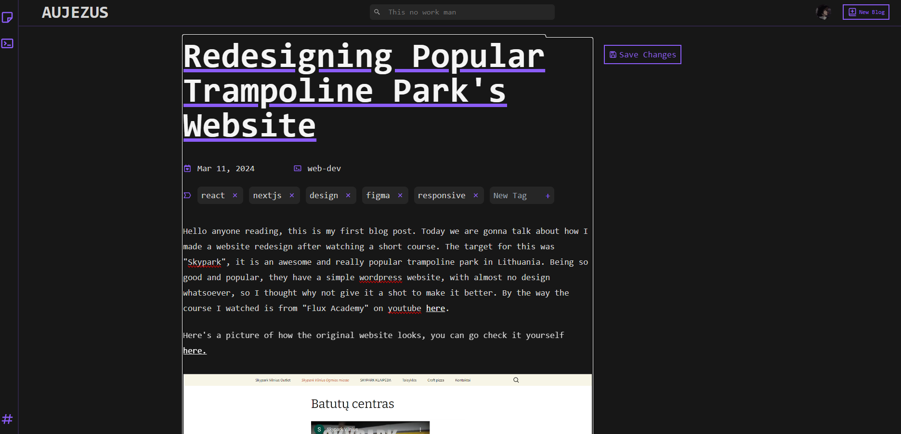
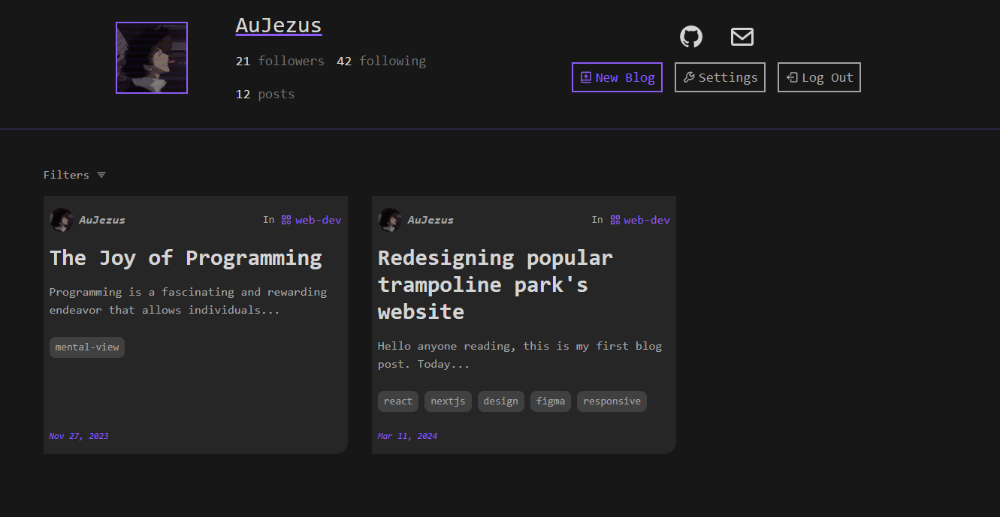
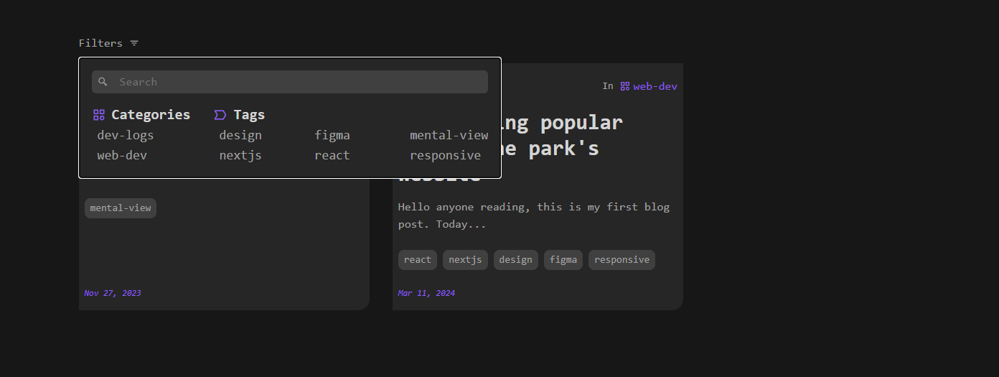

This project represents one of my earlier ventures into React. While it's not without its flaws—the code isn't the cleanest, and some features like the contact form are non-functional—it served as an invaluable learning experience.

## Hero

Contrary to popular belief, the hero section isn't a video; it's actually a large image with CSS animations that give the illusion of a video. Additionally, I incorporated a random glitch effect to evoke a sense of developer ambiance.

## Public Blog

One of the standout features of this website is its public blog. Users can log in with Gmail or GitHub accounts to post blog entries. The sidebar includes categories such as dev-logs, web-dev, and aujezus, allowing visitors to filter content based on their interests. The 'aujezus' category exclusively showcases my own blogs. While I had plans to expand the categories as the content grew, other projects took precedence.

### WYSIWYG Editor

The most challenging part of this project was implementing the WYSIWYG editor using Tiptap. While it may not have all the fancy features, it gets the job done for writing blogs. At the time, I thought it was pretty cool to have a tool that allowed me to format text and add images easily.

### Profiles

In addition to posting blogs, users can set up profiles, add links, and view posts by specific users. I had intentions to implement a following feature, but it remained on the drawing board.

### Filter Button

Implementing a filter system for the first time was a learning curve. However, I believe I created an intuitive filter system that effectively categorizes content based on tags and categories.

## Conclusion

While this project may not be perfect, it represents an important step in my journey as a developer. It's a testament to my early experimentation and growth in React development.

Thank you for taking the time to explore it!
