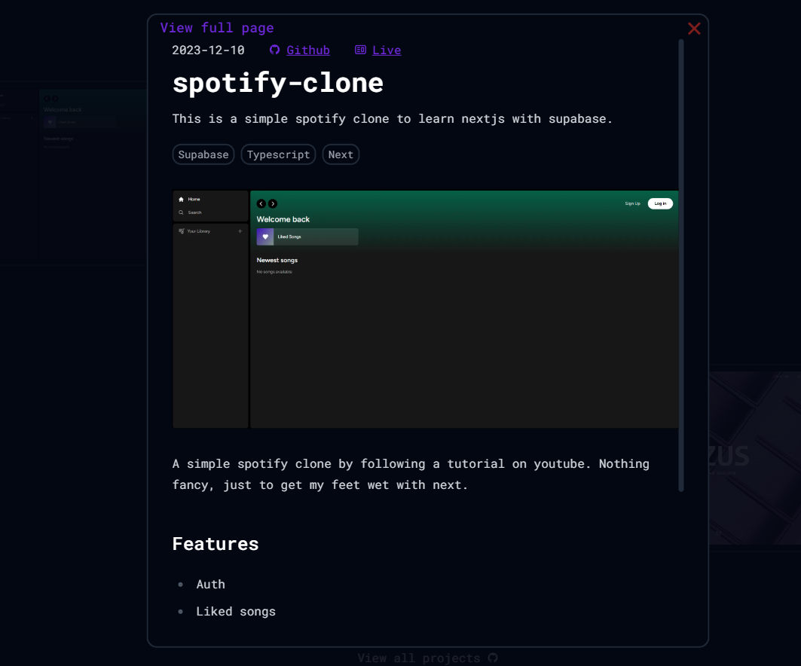
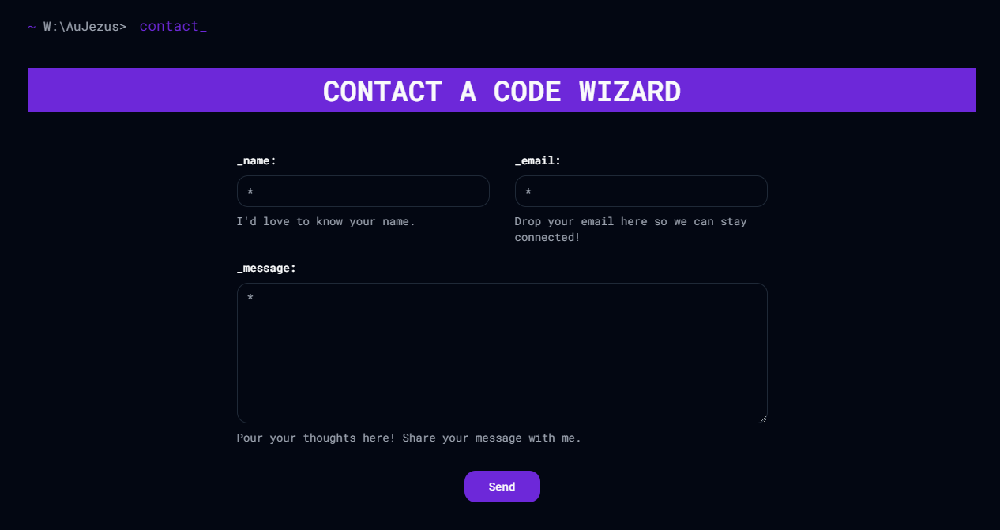
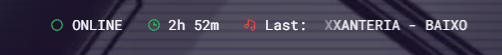
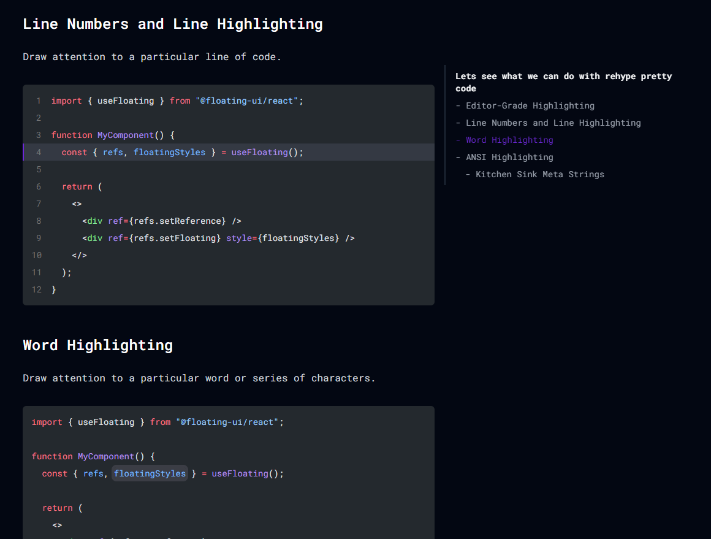

## Goals

With this project, my goals were to **learn TypeScript** and **strengthen my Next.js skills**. The v2 version was outdated and kinda crappy by my current standards. Also, it used plain React, so I had to **upgrade it to Next.js**.

## Features

I aimed to keep this website simple and straightforward, avoiding unnecessary features.

### Hero Design

I wanted to create a captivating hero design to grab visitors' attention momentarily before they move on. It combines a few effects:

1. **Moving Picture:** The background features a large, zoomed-in picture animated with CSS.
2. **TV Line Effect:** Subtle lines move akin to an old TV, achieved with CSS gradients.
3. **Glitching Effect:** To convey developer vibes, I added a glitch in the system effect. While creating this noise/glitch effect purely with CSS wasn't feasible, I utilized an SVG element with special parameters and TypeScript to introduce glitches at random intervals and varying strengths.

### Parallel + Intercepting Route Modal

For the project section, I aimed to provide a modal view for quick project glances without navigating to another page. Leveraging Next.js' new features, Parallel and Intercepting routes, made this possible.

In brief, Parallel routes enable combining multiple pages into one route or, in this case, a modal. Intercepting routes allow soft navigation to be intercepted to render a different view. This approach maintains context in the background while showing a modal instead of navigating to a project page directly.

Additionally, this modal implementation offers benefits like being able to close it by navigating back and sharing URLs.

### Fully Featured Forms with Zod and React Hook Form in Next.js

I wanted to streamline form handling in Next.js, incorporating server actions, client-side validation, and server-side validation. Using React Hook Form facilitated client-side features, though integrating it with server actions, handling errors, and preserving previous states required some workaround. After some research, I managed to make it work seamlessly. You can try it out in the contact section.

### Sending Emails with React Email

I was keen on sending custom-designed emails that align with my website's aesthetics, initially for contact form submissions and eventually for a newsletter.

However, implementing this proved trickier than expected. Many modern HTML features don't work, necessitating the use of outdated methods unfamiliar to me. Nonetheless, with perseverance, I cracked the design and implemented email sending using Nodemailer.

Now, when someone sends me a message, I receive an email containing their information, while they receive a confirmation message thanking them for their inquiry.

### My Stats in the Nav Bar

Inspired by websites like [dimden](https://dimden.dev/) and [wiscaksono](https://wiscaksono.com/), I decided to display my latest song and my current working status (indicating whether I'm online and how much time I've spent coding today) in the navigation bar. Implementing the working status was straightforward using the Wakatime API, while for the latest track, I utilized the LastFM API.

### Blog

In version 2, I implemented a WYSIWYG editor and stored data in a database. While it worked adequately, extending or adding new features was challenging to maintain.

Therefore, I switched to Markdown, specifically MDX, which supports embedding React code. To manage my content in a type-safe manner, I opted for **Velite**. Setting up Velite was easy, and its type safety for MDX files proved invaluable.

Also implemented this cool table of content!

## Conclusion

I'm proud of the website I've created, it's a reflection of my skills and preferences. I look forward to showcasing it to recruiters during my job search. Plus, writing blog posts has become more enjoyable since I can do it within my IDE, commit to GitHub, and see it live on my website.

Thank you for reading!
