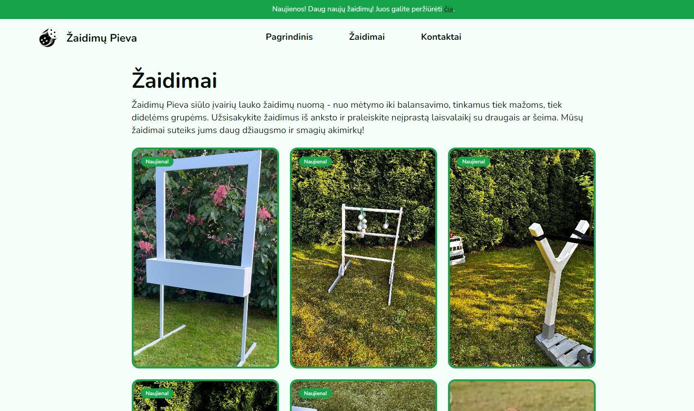
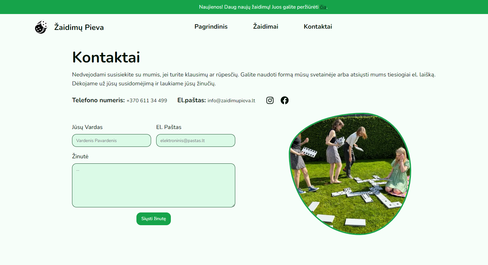

A simple website for a friend's lawn game rental business. It shows the games,
prices, games availability and lets people send a message to book.

## Tech stack

- Next.js + TypeScript for a fast, SEO friendly site.
- Tailwind CSS for styling.
- shadcn/ui for optimized and ready to use UI parts.
- Contentful as the CMS to edit text and images.
- Web3Forms to handle the contact forms.

## What it does

- Fun wave look leveraging [haikei](https://haikei.app/) generator.
- Games list pulled from Contentful with pictures, text, tags, and optional filters.
- Contact/booking form with Web3Forms, with validation.
- Pages you can edit in the CMS without redeploying.
- Works well on phones and desktops.
- Basic SEO: titles, Open Graph, sitemap, clean links.
- Good performance: nextjs image optimization, nextjs server actions, nextjs server rendering.
- Accessibility basics: clean HTML, good color contrast for accessibility, shadcn/ui components that are accessible by default.

## Content model (Contentful)

- Game: name, description, tags, image, slug, long description, dates (added, booked from/until).
- Home page: hero text and image, sections for games, process, and events.
- Game page: title and short paragraph.
- Contact page: title and paragraph.
- Notification: title and optional rich text message.
- Site info: phone, email, Facebook, Instagram, site title.
- Testimonial: person's name, comment, optional image.

## How it works (in simple terms)

- Contentful stores all the text and images so updates don't need code changes.
- Next.js reads that content and renders pages quickly.
- Tailwind and shadcn/ui keep the look consistent and easy to adjust.
- Web3Forms sends form messages to email without running a server.

## Nice-to-have next

- Multiple languages with `next-intl`.
- Simple checkout or deposit with Paysera or Neopay.

